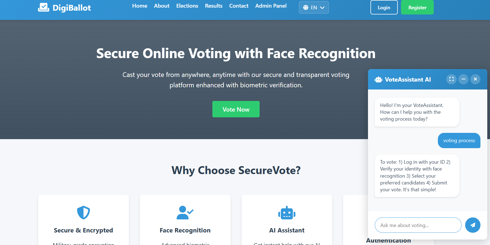
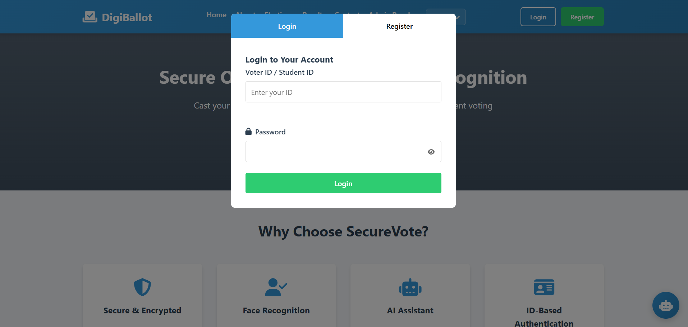
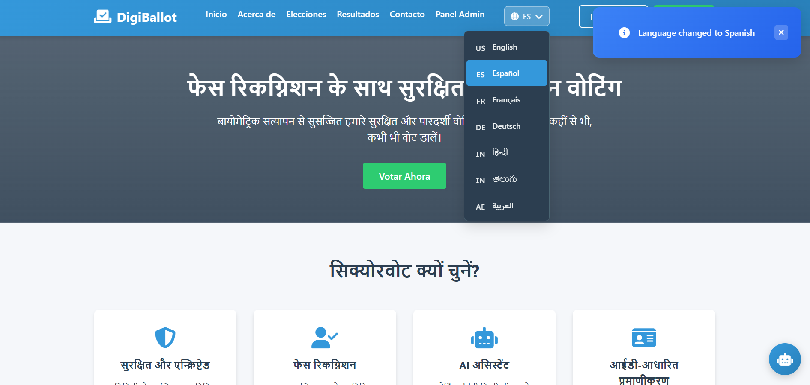
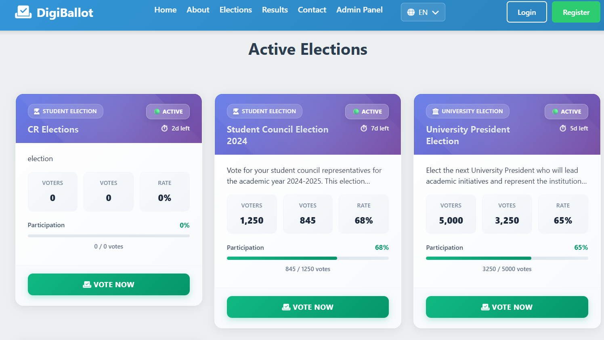
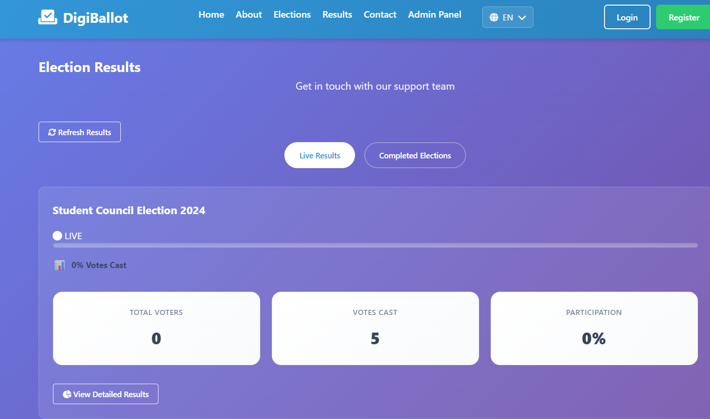
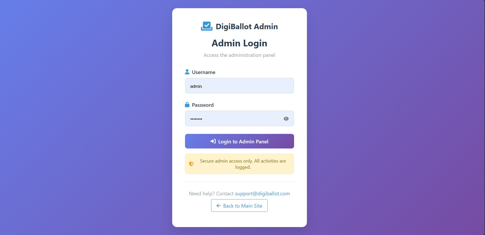
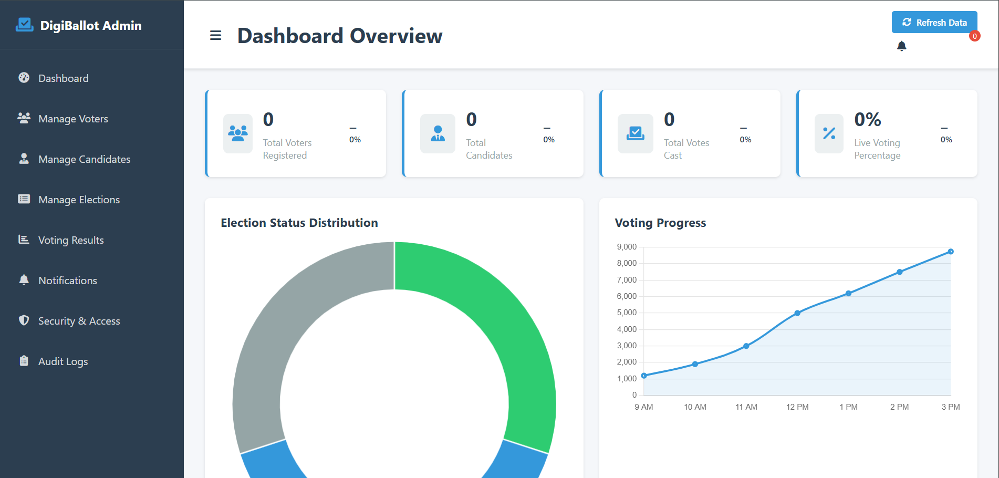

# Online-Voting-System
# 🗳️ DigiBallot – Online Voting System

DigiBallot is a secure, web-based **Online Voting System** designed to conduct elections digitally with transparency, reliability, and ease of access. The system provides separate interfaces for **voters** and **administrators**, ensuring smooth election management and secure vote casting.

---

## 📌 Features

### 👥 Voter Module
- User registration and login
- Secure authentication
- View active elections
- Cast vote online (one voter → one vote)
- Face recognition support (UI ready)
- View live and completed election results
- AI chatbot for user assistance
- Responsive and user-friendly interface

### 🛠️ Admin Module
- Secure admin login
- Admin dashboard with analytics
- Manage voters and candidates
- Create, update, and manage elections
- Monitor real-time voting progress
- View and publish election results
- Audit logs and security controls

---

## 🏗️ Project Structure
VOTING-SYSTEM/
│
├── .dist/ # Build / distribution files
├── assets/ # Images, icons, and static assets
│
├── scripts/ # JavaScript files
│ ├── auth.js # User authentication logic
│ ├── chatbot.js # AI chatbot functionality
│ ├── face-recognition.js # Face recognition (biometric UI)
│ ├── main.js # Main site logic
│ ├── voting.js # Voting process logic
│ │
│ └── admin/ # Admin scripts
│ ├── admin.js
│ ├── auth.js
│ ├── dashboard.js
│ ├── voters.js
│ ├── candidates.js
│ ├── elections.js
│ └── results.js
│
├── styles/ # CSS files
│ ├── auth.css # User authentication styles
│ ├── chatbot.css # Chatbot UI styles
│ ├── main.css # Main site styles
│ │
│ └── admin/ # Admin styles
│ ├── admin.css
│ └── auth.css
│
├── admin/ # Admin HTML files
│ ├── index.html # Admin dashboard
│ └── login.html # Admin login page
│
├── index.html # Main landing page
├── .hintrc # Code quality / lint configuration
└── README.md # Project documentation

---

## 🧰 Technologies Used

### Frontend
- HTML5  
- CSS3  
- JavaScript (Vanilla JS)  
- Font Awesome  
- Chart.js  

### Backend (Extendable)
  - Node.js & Express
  - PHP & MySQL
- REST APIs for voting and authentication

---

## 🔐 Security Features

- Secure login system
- One vote per voter enforcement
- Admin access control
- Activity and audit logs
- Encrypted communication (recommended HTTPS)
- Face recognition support (backend integration required)

---

## 📸 Screenshots

### 🏠 Home Page
Displays the main landing page with features, active elections, and navigation options.

---

### 🔐 User Login & Registration
Allows voters to securely register and log in to the system.

---

### 🌐 Multi-Language Support
Allows users to switch between multiple languages for better accessibility and usability.

---

### 🗳️ Voting Interface
Secure voting screen where users can select candidates and cast their vote.

---

### 📊 Election Results
Shows live and completed election results in a graphical format.

---

### 🛠️ Admin Login
Secure login page for administrators.

---

### 📈 Admin Dashboard
Admin panel to manage voters, candidates, elections, and view analytics.

